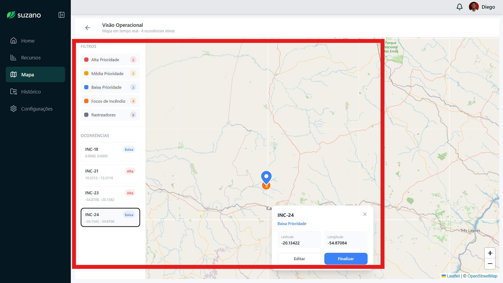

# Ponderada 3 - Roteiro e Teste de Usabilidade
**Aluno:** Diego Figueiredo Silva

## 1. Tela(s) analisada(s)

Esta é a tela “Mapa Operacional” do projeto Suzano. É um mapa interativo em tempo real que mostra ocorrências ativas (pins coloridos) na região de Campo Grande/MS, com filtros de prioridade e lista de ocorrências.

## 2. Tipo de teste
**Visualização de dados**  
Vamos testar se o usuário **entende** o mapa, interpreta as cores/ícones e consegue tomar decisões rápidas com ele.

## 3. Conjunto de perguntas (Técnica do Funil)

1. **Pergunta ampla (bem no topo do funil):**  
   “Olhando para essa tela do mapa, o que você acha que ela está tentando te mostrar ou contar?”  
    **Objetivo:** Ver o que o usuário entende sozinho, sem nenhuma dica.

2. **Pergunta de follow-up (ainda aberta):**  
   “Quais elementos do mapa você nota primeiro? O que te chama mais atenção (posições, cores, ícones, linhas etc.)?”  
    **Objetivo:** Fazer ele falar sobre o que ele está vendo naturalmente.

3. **Pergunta semi-direcionada:**  
   “Você consegue explicar o que significam as cores dos pins, os ícones de fogo e os círculos cinza que aparecem no mapa?”  
    **Objetivo:** Começar a testar se ele entende a legenda e os símbolos.

4. **Pergunta mais específica:**  
   “De acordo com o que você está vendo, qual é a ocorrência ou região com maior prioridade no momento? O que as linhas tracejadas parecem indicar?”  
    **Objetivo:** Verificar se ele identifica corretamente “Alta Prioridade” (pin vermelho) e o significado das linhas.

5. **Pergunta fechada / de praticabilidade (fundo do funil):**  
   “Com base no que aparece nesse mapa agora, que ação ou decisão você tomaria como operador da Suzano?”  
    **Objetivo:** Ver se o mapa realmente ajuda a tomar uma decisão real (ex: “vou mandar equipe pro pin vermelho”).

## 4. Objetivo do teste
Avaliar se o mapa é **claro e útil** para quem vai usar no dia a dia. Queremos descobrir se o usuário entende rápido o que está acontecendo e se consegue agir com base nas informações.

## 5. Ação ou entendimento esperado
O usuário deve:
- Entender que é um mapa de monitoramento em tempo real;
- Saber que cor = prioridade, fogo = foco de incêndio, linhas = rota/conexão;
- Identificar rapidamente as ocorrências de Alta Prioridade;
- Dizer uma ação prática (ex: enviar equipe, checar rastreador etc.).
